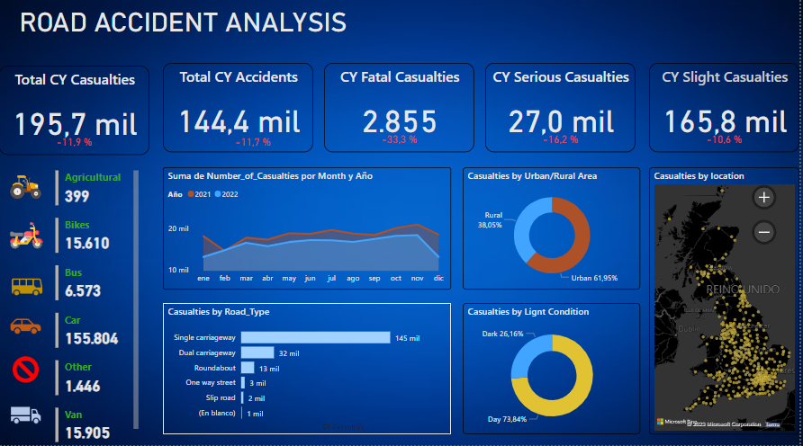

# UK Traffic Accident Trends Dashboard with Power BI

## Project Overview
This repository contains a Power BI dashboard that provides a visual analysis of traffic accidents in the UK. The dashboard aims to elucidate patterns and trends in accident data, offering insights into causality, severity, and frequency by various dimensions such as vehicle type, location (urban vs rural), and time factors.

## Features
- Data cleansing and preparation for accurate analysis.
- Yearly trend examination to identify changes in accident rates.
- Severity analysis to differentiate between fatal, serious, and slight casualties.
- Vehicle type categorization to understand the impact of different vehicles on accident statistics.
- Urban vs rural accident location analysis to highlight geographical safety disparities.
- Time-based incident distinction to explore the influence of time on accident occurrence.
- Interactive charts and maps for a user-friendly data experience.

## Visualizations
The dashboard includes several types of visualizations:
- Line and bar charts for trend analysis over months and years.
- Pie charts to represent the proportion of urban vs rural accidents.
- A map of the UK pinpointing specific accident locations.
- Donut charts illustrating the distribution of accidents by light conditions.

## Data Source
The data used in this dashboard has been sourced from publicly available UK government datasets on traffic accidents. The raw data has been processed and cleaned to ensure accuracy and relevance to the analysis.

## Tools Used
- **Microsoft Power BI**: For creating and publishing interactive visualizations.
- **Data Cleansing Tools**: For preparing the dataset for analysis.

## Getting Started
To explore the dashboard:
1. Clone the repository to your local machine.
2. Open the `.pbix` file with Microsoft Power BI.
3. Use the filters and slicers to interact with the data visualizations.

## Contributions
Contributions are welcome! If you have suggestions or improvements, please fork the repository and submit a pull request.

## Contact
For any further queries or discussions, feel free to contact me at acampagioria@gmail.com.

Thank you for exploring the UK Traffic Accident Trends Dashboard. Your feedback and contributions can help to further improve road safety analysis!
